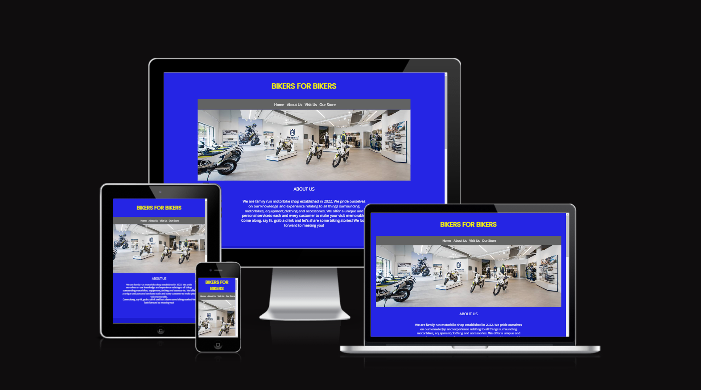
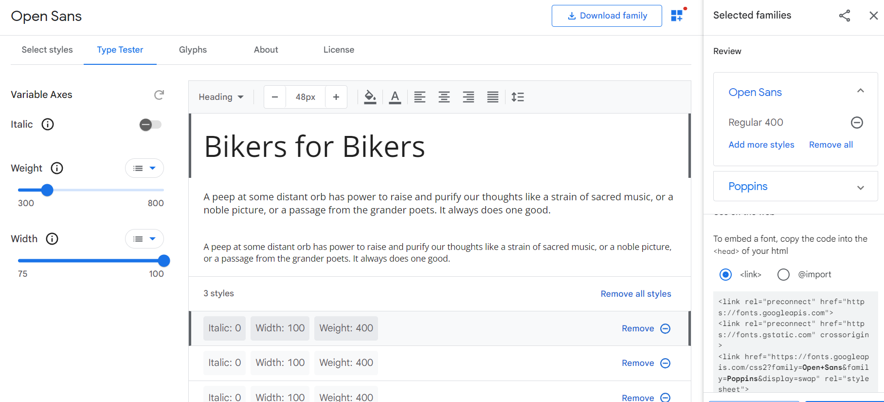
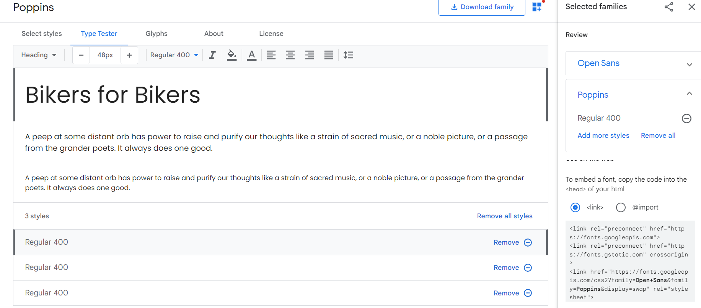
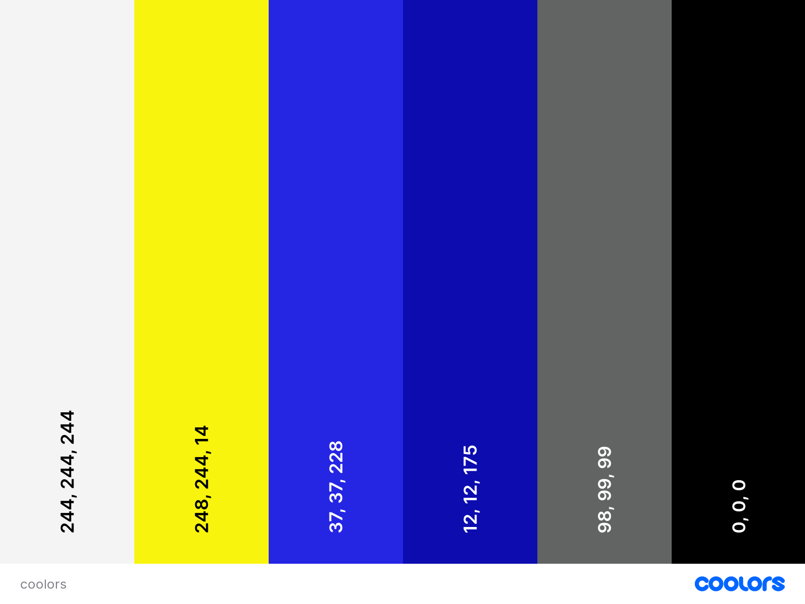
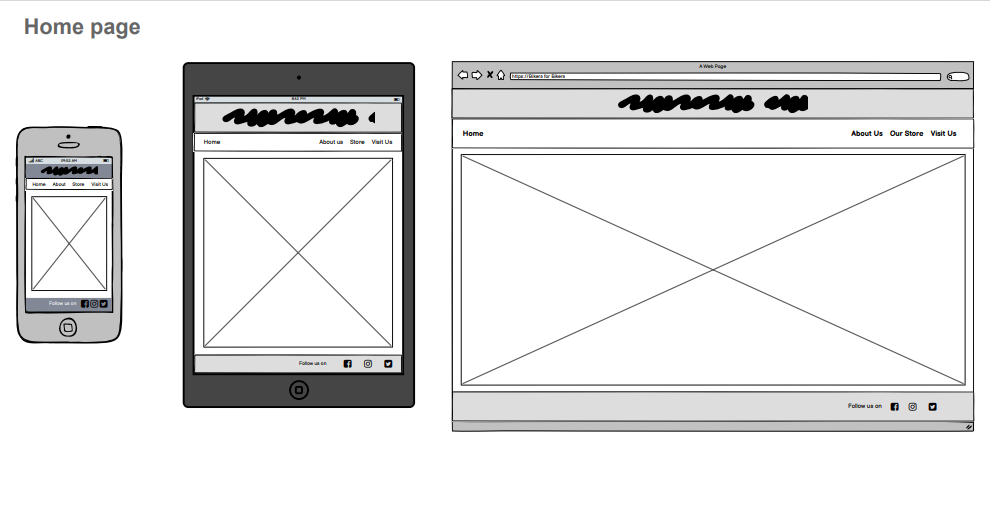
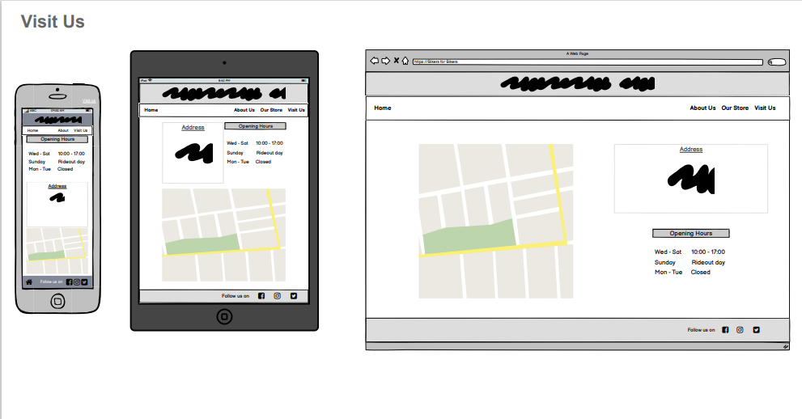

# Bikers for Bikers

# Table of Content
- [Project goals](#Project)
  - User goals
  - Site Owner Goals
- [User Experience](#user-experiance)
  - Target Audiance
  - User Expectation
  - User Stories
- [Design](#design)
  - Colors used
  - Fonts used
  - Structure
  - Wireframes
- [features](#features)
- [Technology Used](#technology-used)
  - Languages Used
  - Frameworks & Tool
- [Testing](#testing)
  - Html Validation
  - CSS Validatiion
  - Accessibility
  - Performance
  - Browser Compatibility
- [Deployment](#deployment)
- [Credits](#credits)

# Project
## Overview
 - A website for for anyone who would like to purchase a motorcycle, motorcycle accessories, clothing for themselves or for their loved ones.  
## User Goals
 - Finding a place to purchase not only motorcycle, but clothes and accessories as well.
 - Find information about the shop.
 - Find the location of the shop. 
## Site Owner Goal
 - Increase a number of happy customers.
 - Promote the bussines.
 - Provide a way for new and existing customers to contact the store.
 - Provide information about the bussines to customer. 
# User Experiance
## Target Audience
 - User is looking for place to buy all they need in one go.
 - User would like to order online and get it delivered.
 - User would like to visit shop in person.
 - User would like to know who they are dealing with.
 ## User Expectations
 - A simple navigation system.
 - Quick and easy to find relevant information.
 - Simple content that user can skim read.
 - Easy way to contact the bussines.
 - Simple instruction how to find our store.
# User Stories
### First Time User
 - Easily navigate throughout the website.
 - Find relative information about the product.
 - Contact the store with any enquiries.
 - Find directions and opening hours so I can plan a visit in person.
### Returming User
 - Open the website on any device.
 - Access the website in any browser.
 - Receive promotional codes and offers.
 - Contact the store with any enquiries.
 - I would like to find the store on social media.
 - Find directions and opening hours so I can plan a visit in person.
### Site owner
 - I would like users to receive news and offers from our store.
 - I would like users to be able to contact us.
 - I would like users to be able to find information where to visit us.
 - I would like users to be able to find information about when store is open.
# Design
## Fonts used 
### Open Sans
 - The Open sans font is the main font used used throughout the website with San Serif as the fallback font. It is easy to read font and it was imported to css document from [Google fonts](https://developers.google.com/fonts).

### Poppins
 - Poppins It is easy to read font and it was used for hero logo only. Font was imported to css document from [Google fonts](https://developers.google.com/fonts) and it has a fallback font of San Serif.

## Colors used
 - Colors used in this project are matching color scheme of the product.

# Wireframes

# Features

## Existing Features

## Logo and Navigation bar
 - Featured on every page
 - Navbar including a Home, About us, Our store and Visit us buttons with links to coresponding pages
 - It allows user to easily navigate the page

## Home page
 - webpage includes header with hero logo
 - navigation bar
 - an image of the shop
 - from home page we gain access to About us secion, Our Store, and Visit us section

## About us
 - User can find a few words about history of our company, and where it all sterted.
 - Section Gallery with link to our gallery
 - Section Contact us with link to our contact form

## Our store
 - Webpage includes two different types of product categories.
    - motorcycles
    - clothing

## Contact us
- webpage includes header with hero logo
 - navigation bar
 - webpage includes a two different types of form
   - general enquiry
   - newsletters

## gallery
- webpage includes header with hero logo
 - navigation bar
 - user can view a photos about our shop

## Visit us
 - opening hours
 - shop adress
 - google map

## Footer
 - a classic footer with links to social media positioned to the middle 

# Technology used
## Languages
 - HTML5
 - CSS3
## frameworks & Tools
 - Google Fonts
 - Google Maps
 - Fontawesome
 - Gitpod
 - Github

# Testing
 - Html Validation
 - CSS Validatiion
 - Accessibility
 - Performance
 - Browser Compatibility

# Deployment

# Credits
 - Code
 - Media
 - Acknowledgements

[Back to top](#bikers-for-bikers)