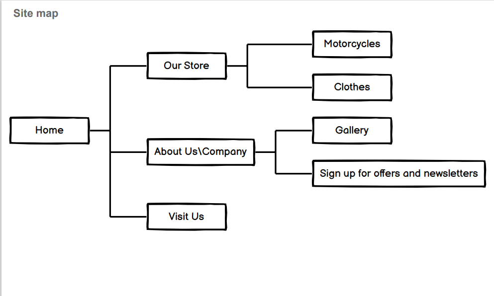
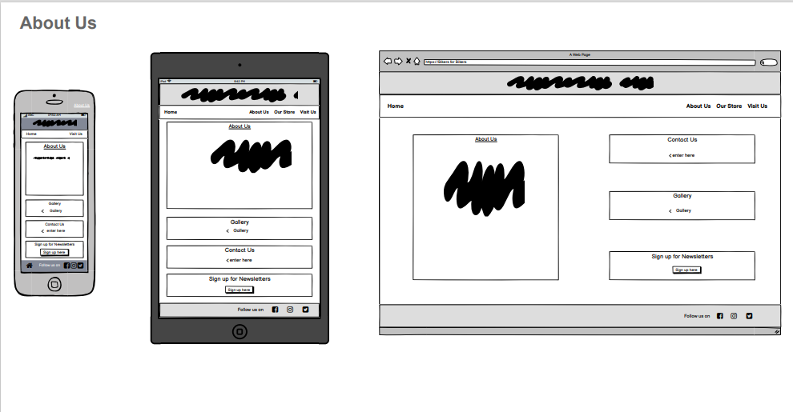
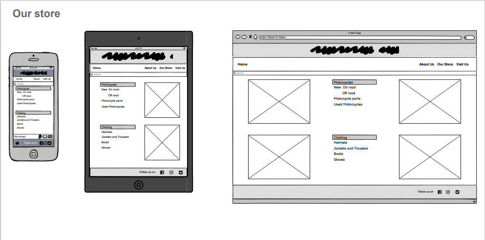
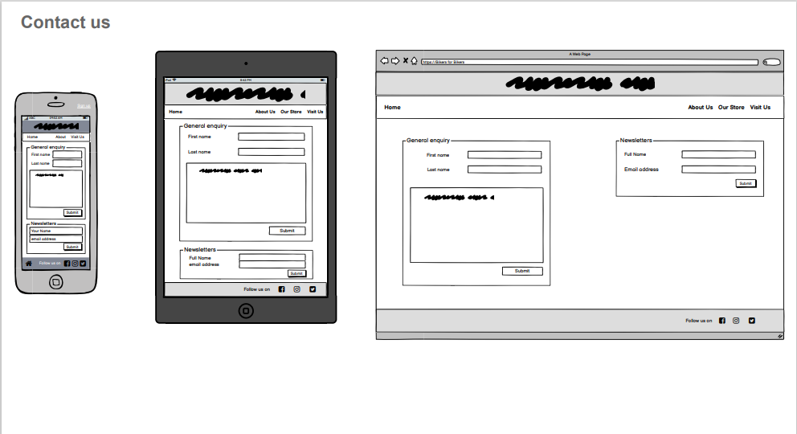

# Bikers for Bikers
# Content
# Project Overview
 - A website for for anyone who would like to purchase a motorcycle, motorcycle accessories, clothing for themselves or for their loved ones.  
# UX
 - Bikers for Bikers was designed to provide easy navigation throughout the website with simple to read text and photos.
# User Stories
## As a user, I would like to 
 - easily navigate throughout the website
 - find relative information about the product
 - contact the store with any enquiries
 - receive promotional codes and offers
 - find directions and opening hours so I can plan a visit in person 
 - open the website on any device
 - access the website in any browser
# Fonts and Colors
# Wireframes

# Features
## Existing Features
## Hero Logo
 - Fixed within the header at the top of every page 
## Navigation bar
 - featured on every page below header
 - Including a Home, About us, Our store and Visit us buttons with links to coresponding pages 
## Home page
- webpage includes header with hero logo
 - navigation bar
 - an image of the shop
 - from home page we gain  access to About us page, Store page and Visit us page
## About us
- webpage includes header with hero logo
 - navigation bar
 - User can find a few words about history of our company, and where it all sterted.
 - link to our gallery
 - link to our contact form
 - link to our newsletter sign up form
## Our store
 - webpage includes header with hero logo
 - navigation bar
 - search bar is below navigation bar for quick find of a desired product
 - webpage includes two different types of product 
    - motorcycles
    - clothing
## Contact us
- webpage includes header with hero logo
 - navigation bar
 - webpage includes a two different types of form
   - general enquiry
   - newsletters
## gallery
- webpage includes header with hero logo
 - navigation bar
 - user can view a few photos from inside and outside of the shop
## Visit us
 - webpage includes header with hero logo
 - navigation bar
 - shop adress
 - google map
 - opening hours 
## Footer
 - a classic footer with links to social media positioned to the right hand side 
# Technology used
 - HTML5
 - CSS3
 - Google Fonts
 - Google Maps
 - Fontawesome
 - Gitpod
 - Github
# Testing
# Deployment
# Credits
